# D-licias_Fast_Food
# Desplegar Proyecto Web D'Licias Fast Food Localmente con Windows

Pasos a Seguir:

📋 Qué Necesitas

- XAMPP instalado

- El proyecto descomprimido

1. Preparar XAMPP
Abrir XAMPP Control Panel
Iniciar Apache y MySQL
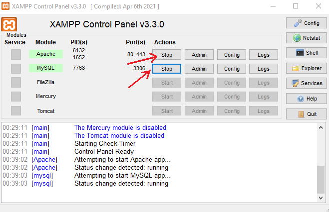

2. Colocar tu Proyecto
Copiar tu carpeta del proyecto a: C:\xampp\htdocs\

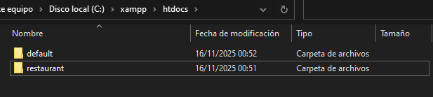

4. Configurar Base de Datos en phpMyAdmin
Abrir navegador
Ir a: http://localhost/phpmyadmin

Crear nueva base de datos:
Click en "Nueva"
Nombre: db_broasteria
Click "Crear"
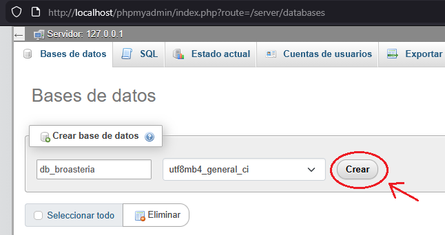
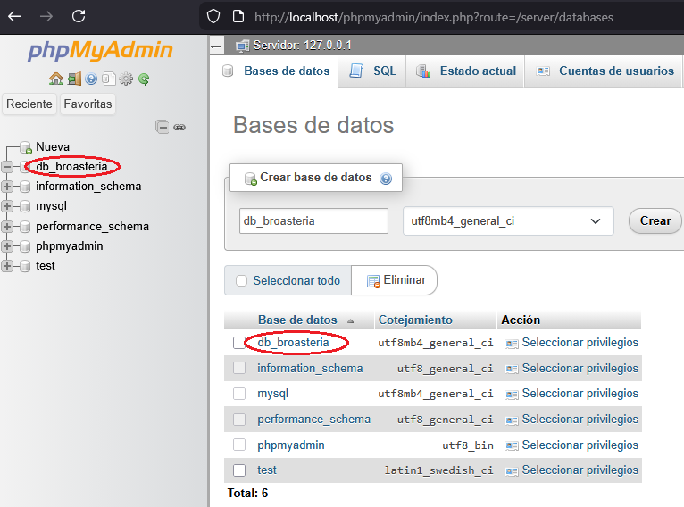

Pantalla principal
Crear base de datos

4. Importar o Crear Tablas
Seleccionar tu base de datos
Click en "Importar" para subir archivo .sql
O crear tablas manualmente con "SQL"

En este Caso Crearemos las tablas con algunos datos.
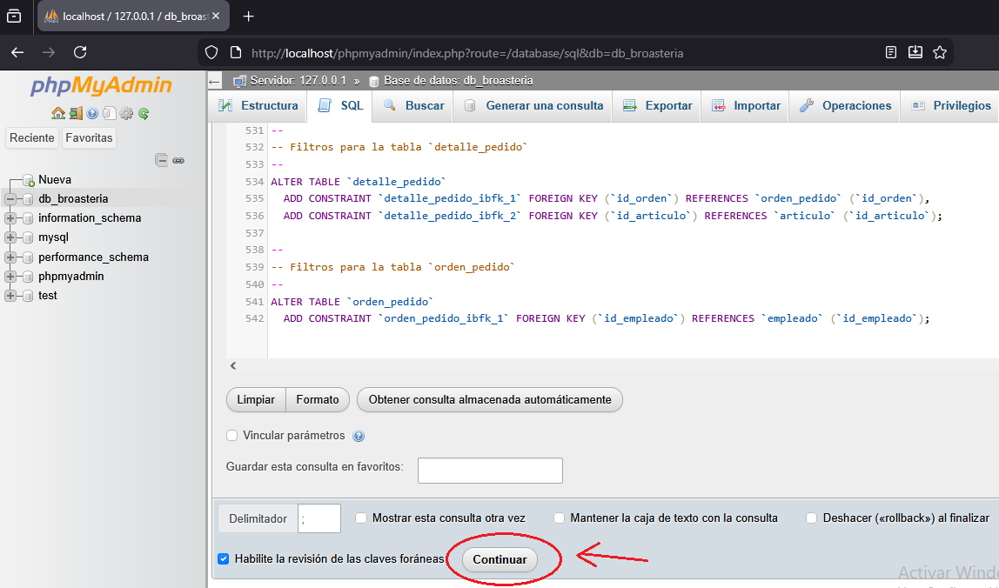
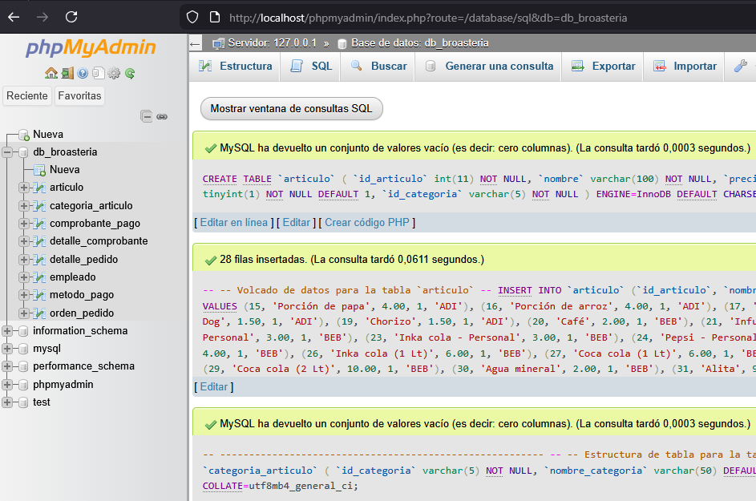

5. Configurar Conexión a BD en tu Proyecto
Asegurate que tu archivo archivo PHP de conexión este de la siguiente forma:

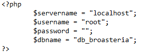

6. Verificamos la pagina en red local todo deberia funcionar con normalidad

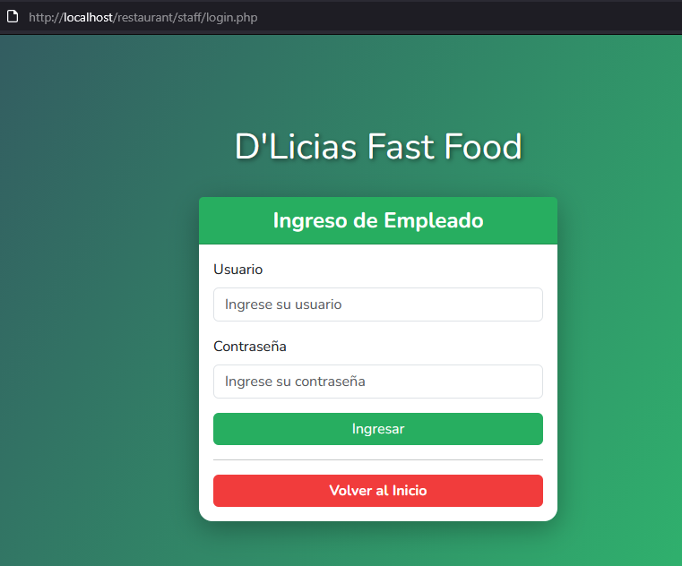

# Desplegar Proyecto Web D'Licias Fast Food en la nube AWS EC2 con Windows Server 2019
🚀 Guía: Desplegar Proyecto Web D'Licias Fast Food en la nube AWS EC2 con Windows Server 2019

📋 Prerrequisitos

    Cuenta de AWS

    Proyecto web listo para desplegar

    Conocimientos básicos de AWS EC2

1. Crear Instancia EC2 con Windows Server 2019
Configuración en la consola de AWS:

    Servicio: EC2

    Imagen de máquina de Amazon: "Windows Server 2019 Base"

    Tipo de instancia: t3.small

    Par de claves: connect (.pem)

Configuración de red:

    Ir a Configuraciones de red → Firewall (Grupos de seguridad)

    Seleccionar Crear grupo de seguridad

    Marcar las casillas:

        ✅ Permitir el tráfico de RDP desde 0.0.0.0/0

        ✅ Permitir el tráfico de HTTPS desde Internet

        ✅ Permitir el tráfico de HTTP desde Internet

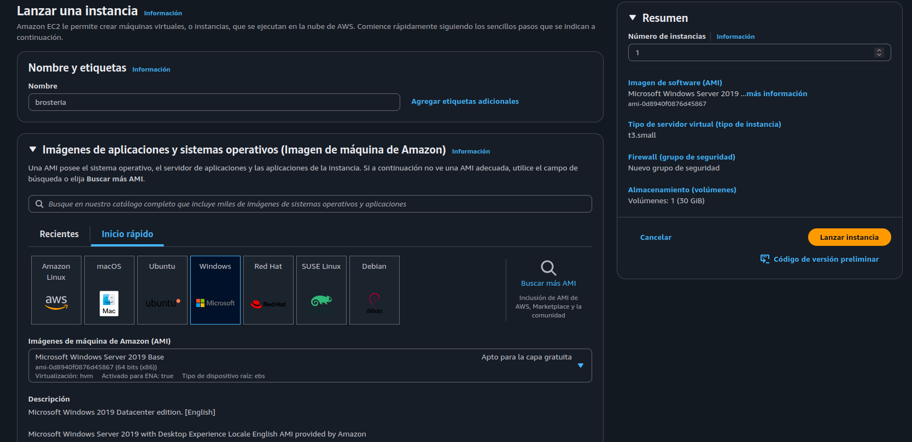
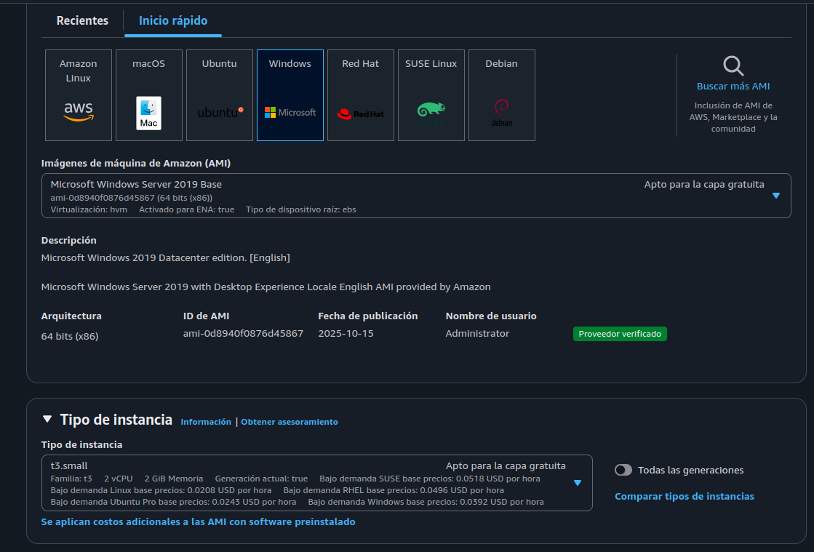

Vista de instancias creadas:

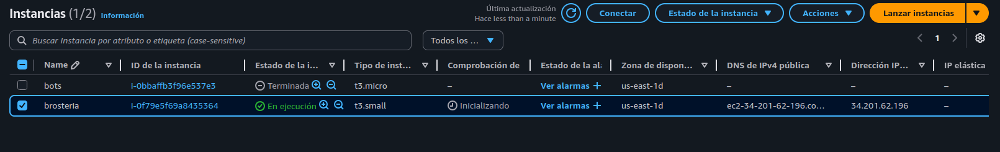

2. Configurar Reglas de Seguridad (Grupo de Seguridad)
En la consola de AWS:

    Ir a "Grupos de Seguridad"

    Crear nuevo grupo o editar el existente

    Agregar reglas:

Tipo	Protocolo	Puerto	Origen	Descripción
HTTP	TCP	80	0.0.0.0/0	Acceso web
HTTPS	TCP	443	0.0.0.0/0	SSL
RDP	TCP	3389	0.0.0.0/0	Administración

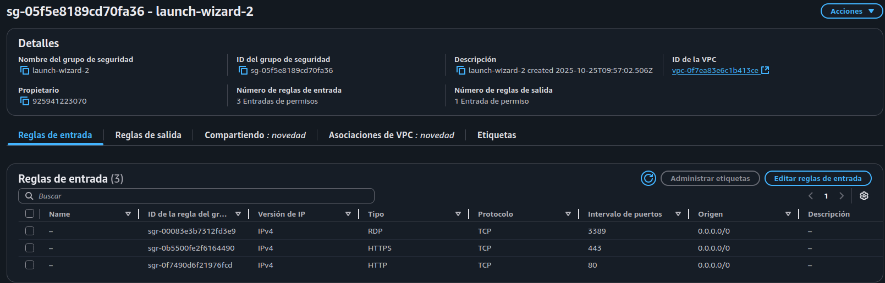

3. Conectar a la Instancia Windows

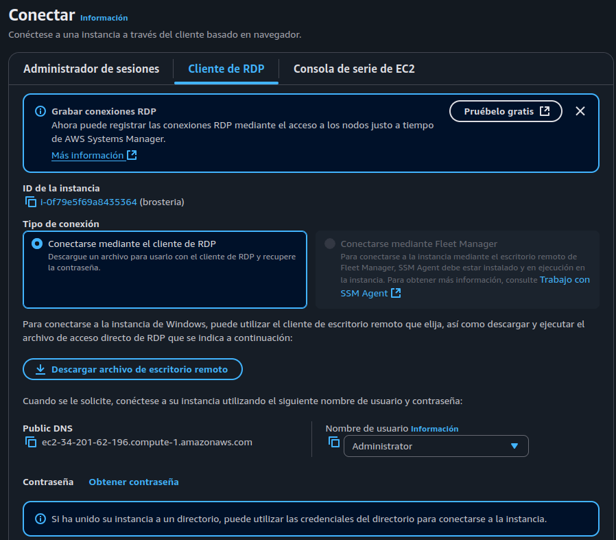

Procedimiento:

    Presionar Conectar → Cliente de RDP

    En la sección contraseña hacer clic en Obtener contraseña

    Subir el archivo .pem generado previamente

    Copiar la contraseña generada

Conexión RDP:

    Usar Conexión Escritorio Remoto

    IP pública: 34.201.62.196 (usar tu IP específica)

    Usuario: Administrator

    Contraseña: La generada en el paso anterior

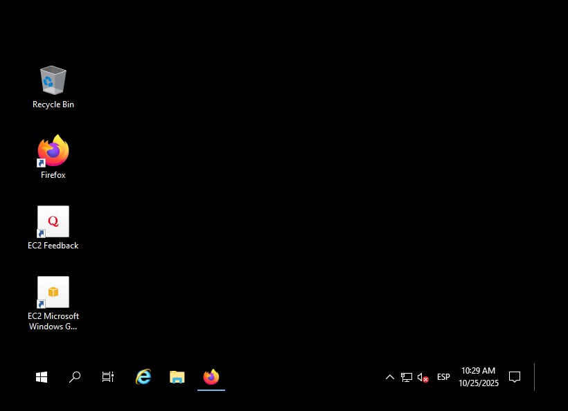

4. Configurar Xampp en Windows Server 2019

En la instancia Windows, instalar y configurar Xampp:

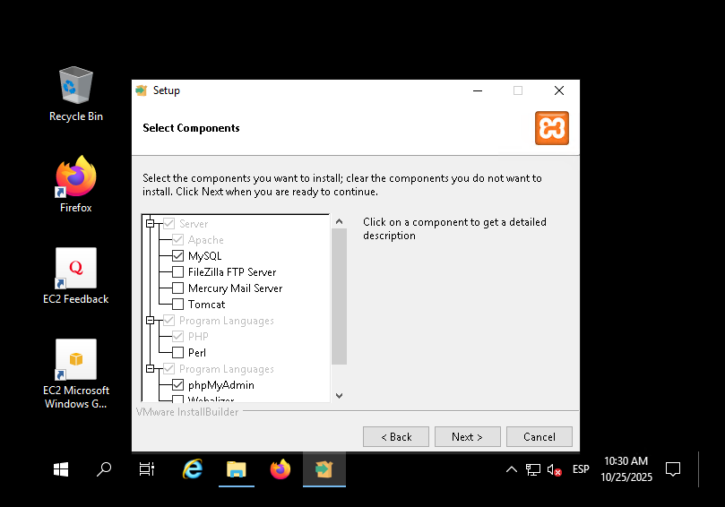
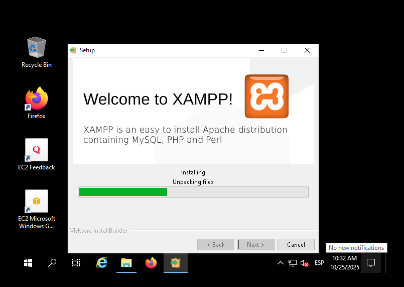

5. Configurar Sitio Web

Desplegar el proyecto web en la carpeta htdocs de Xampp:

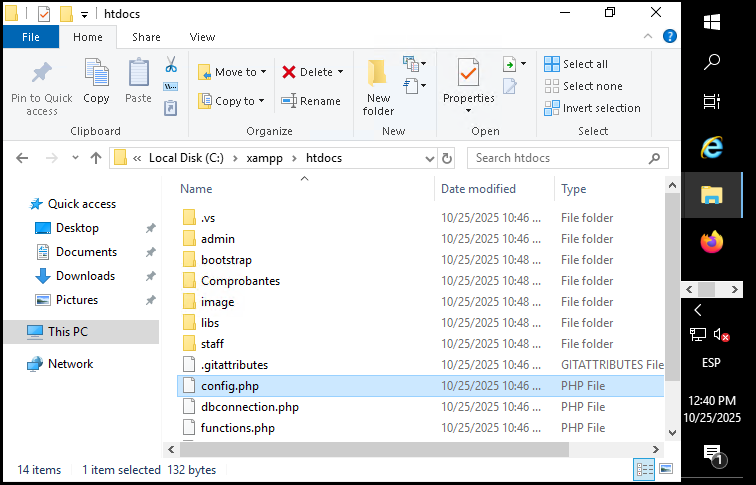
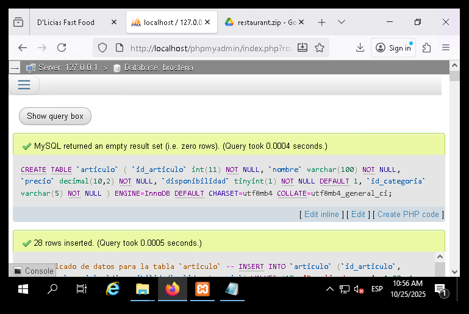

Configurar regla en el firewall de Windows:

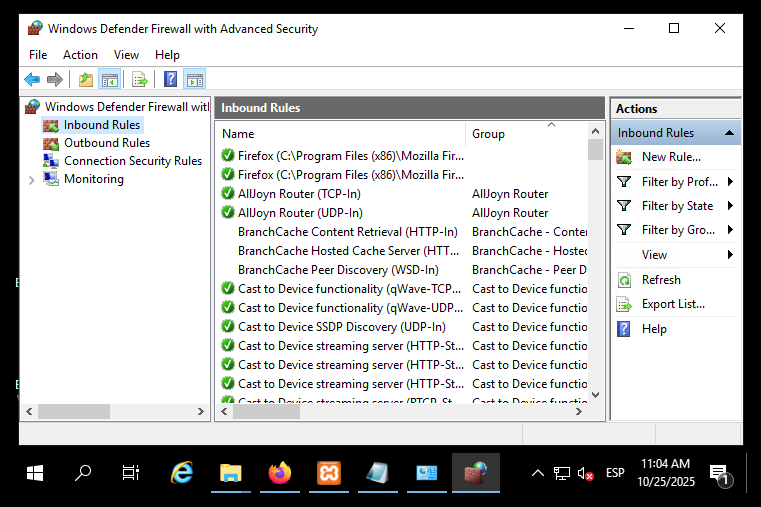

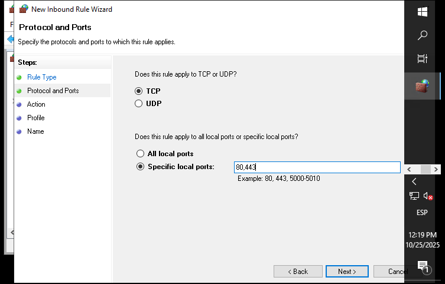
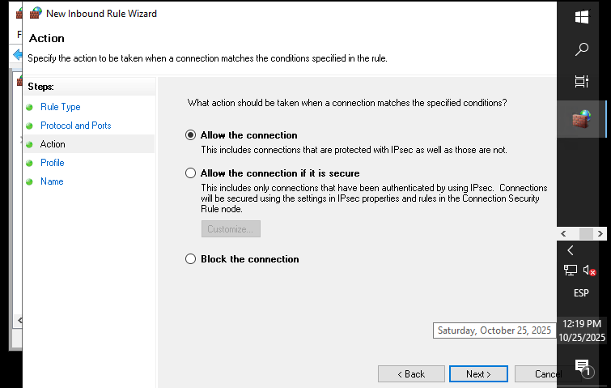
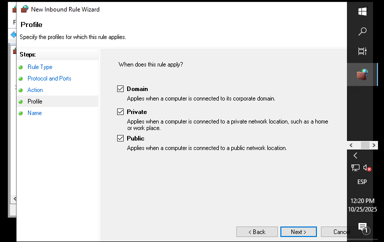

6. Probar el Sitio Web
Obtener IP pública de tu instancia EC2:

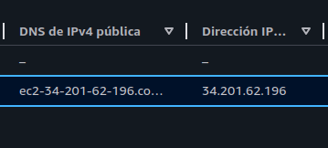

Acceso al sitio web:

Abrir navegador y acceder mediante:

    IP pública: http://34.201.62.196/

    DNS público: http://ec2-34-201-62-196.compute-1.amazonaws.com/

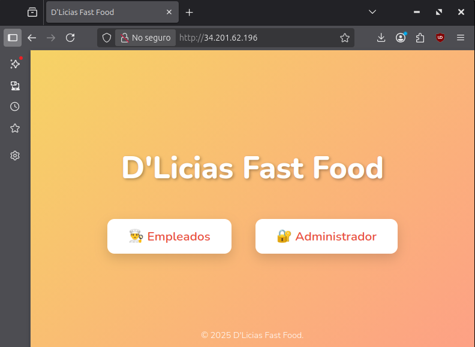
